##### Link to kaggle problem : https://www.kaggle.com/c/competitive-data-science-predict-future-sales/notebooks?sortBy=voteCount&group=everyone&pageSize=20&competitionId=8587

### Steps involved

1. Understand the problem. We'll look at each variable and do a philosophical analysis about their meaning and importance for this problem.

2. Univariable study. We'll just focus on the dependent variable ('SalePrice') and try to know a little bit more about it.

3. Multivariate study. We'll try to understand how the dependent variable and independent variables relate.
    Basic cleaning. We'll clean the dataset and handle the missing data, outliers and categorical variables.
    Test assumptions. We'll check if our data meets the assumptions required by most multivariate techniques.


```python
#import some necessary librairies

import numpy as np # linear algebra
import pandas as pd # data processing, CSV file I/O (e.g. pd.read_csv)


import matplotlib.pyplot as plt  # Matlab-style plotting
%matplotlib inline

import seaborn as sns
color = sns.color_palette()
sns.set_style('darkgrid')

import warnings
warnings.filterwarnings('ignore')


from scipy import stats
from scipy.stats import norm, skew #for some statistics


pd.set_option('display.float_format', lambda x: '{:.3f}'.format(x)) #Limiting floats output to 3 decimal points

```


```python
#Now let's import and put the train and test datasets in  pandas dataframe

train = pd.read_csv('/Users/menukajaiswal/Downloads/house_price/train.csv')
test = pd.read_csv('/Users/menukajaiswal/Downloads/house_price/test.csv')

```


```python
##display the first five rows of the train dataset.
train.head(5)
```


<div>
<style scoped>
    .dataframe tbody tr th:only-of-type {
        vertical-align: middle;
    }

    .dataframe tbody tr th {
        vertical-align: top;
    }

    .dataframe thead th {
        text-align: right;
    }
</style>
<table border="1" class="dataframe">
  <thead>
    <tr style="text-align: right;">
      <th></th>
      <th>Id</th>
      <th>MSSubClass</th>
      <th>MSZoning</th>
      <th>LotFrontage</th>
      <th>LotArea</th>
      <th>Street</th>
      <th>Alley</th>
      <th>LotShape</th>
      <th>LandContour</th>
      <th>Utilities</th>
      <th>...</th>
      <th>PoolArea</th>
      <th>PoolQC</th>
      <th>Fence</th>
      <th>MiscFeature</th>
      <th>MiscVal</th>
      <th>MoSold</th>
      <th>YrSold</th>
      <th>SaleType</th>
      <th>SaleCondition</th>
      <th>SalePrice</th>
    </tr>
  </thead>
  <tbody>
    <tr>
      <th>0</th>
      <td>1</td>
      <td>60</td>
      <td>RL</td>
      <td>65.000</td>
      <td>8450</td>
      <td>Pave</td>
      <td>NaN</td>
      <td>Reg</td>
      <td>Lvl</td>
      <td>AllPub</td>
      <td>...</td>
      <td>0</td>
      <td>NaN</td>
      <td>NaN</td>
      <td>NaN</td>
      <td>0</td>
      <td>2</td>
      <td>2008</td>
      <td>WD</td>
      <td>Normal</td>
      <td>208500</td>
    </tr>
    <tr>
      <th>1</th>
      <td>2</td>
      <td>20</td>
      <td>RL</td>
      <td>80.000</td>
      <td>9600</td>
      <td>Pave</td>
      <td>NaN</td>
      <td>Reg</td>
      <td>Lvl</td>
      <td>AllPub</td>
      <td>...</td>
      <td>0</td>
      <td>NaN</td>
      <td>NaN</td>
      <td>NaN</td>
      <td>0</td>
      <td>5</td>
      <td>2007</td>
      <td>WD</td>
      <td>Normal</td>
      <td>181500</td>
    </tr>
    <tr>
      <th>2</th>
      <td>3</td>
      <td>60</td>
      <td>RL</td>
      <td>68.000</td>
      <td>11250</td>
      <td>Pave</td>
      <td>NaN</td>
      <td>IR1</td>
      <td>Lvl</td>
      <td>AllPub</td>
      <td>...</td>
      <td>0</td>
      <td>NaN</td>
      <td>NaN</td>
      <td>NaN</td>
      <td>0</td>
      <td>9</td>
      <td>2008</td>
      <td>WD</td>
      <td>Normal</td>
      <td>223500</td>
    </tr>
    <tr>
      <th>3</th>
      <td>4</td>
      <td>70</td>
      <td>RL</td>
      <td>60.000</td>
      <td>9550</td>
      <td>Pave</td>
      <td>NaN</td>
      <td>IR1</td>
      <td>Lvl</td>
      <td>AllPub</td>
      <td>...</td>
      <td>0</td>
      <td>NaN</td>
      <td>NaN</td>
      <td>NaN</td>
      <td>0</td>
      <td>2</td>
      <td>2006</td>
      <td>WD</td>
      <td>Abnorml</td>
      <td>140000</td>
    </tr>
    <tr>
      <th>4</th>
      <td>5</td>
      <td>60</td>
      <td>RL</td>
      <td>84.000</td>
      <td>14260</td>
      <td>Pave</td>
      <td>NaN</td>
      <td>IR1</td>
      <td>Lvl</td>
      <td>AllPub</td>
      <td>...</td>
      <td>0</td>
      <td>NaN</td>
      <td>NaN</td>
      <td>NaN</td>
      <td>0</td>
      <td>12</td>
      <td>2008</td>
      <td>WD</td>
      <td>Normal</td>
      <td>250000</td>
    </tr>
  </tbody>
</table>
<p>5 rows × 81 columns</p>
</div>


```python
#check the numbers of samples and features
print("The train data size  is : {} ".format(train.shape))
print("The test data size is : {} ".format(test.shape))
```

    The train data size  is : (1460, 81) 
    The test data size is : (1459, 80) 


```python
train.info()
```

    <class 'pandas.core.frame.DataFrame'>
    RangeIndex: 1460 entries, 0 to 1459
    Data columns (total 81 columns):
    Id               1460 non-null int64
    MSSubClass       1460 non-null int64
    MSZoning         1460 non-null object
    LotFrontage      1201 non-null float64
    LotArea          1460 non-null int64
    Street           1460 non-null object
    Alley            91 non-null object
    LotShape         1460 non-null object
    LandContour      1460 non-null object
    Utilities        1460 non-null object
    LotConfig        1460 non-null object
    LandSlope        1460 non-null object
    Neighborhood     1460 non-null object
    Condition1       1460 non-null object
    Condition2       1460 non-null object
    BldgType         1460 non-null object
    HouseStyle       1460 non-null object
    OverallQual      1460 non-null int64
    OverallCond      1460 non-null int64
    YearBuilt        1460 non-null int64
    YearRemodAdd     1460 non-null int64
    RoofStyle        1460 non-null object
    RoofMatl         1460 non-null object
    Exterior1st      1460 non-null object
    Exterior2nd      1460 non-null object
    MasVnrType       1452 non-null object
    MasVnrArea       1452 non-null float64
    ExterQual        1460 non-null object
    ExterCond        1460 non-null object
    Foundation       1460 non-null object
    BsmtQual         1423 non-null object
    BsmtCond         1423 non-null object
    BsmtExposure     1422 non-null object
    BsmtFinType1     1423 non-null object
    BsmtFinSF1       1460 non-null int64
    BsmtFinType2     1422 non-null object
    BsmtFinSF2       1460 non-null int64
    BsmtUnfSF        1460 non-null int64
    TotalBsmtSF      1460 non-null int64
    Heating          1460 non-null object
    HeatingQC        1460 non-null object
    CentralAir       1460 non-null object
    Electrical       1459 non-null object
    1stFlrSF         1460 non-null int64
    2ndFlrSF         1460 non-null int64
    LowQualFinSF     1460 non-null int64
    GrLivArea        1460 non-null int64
    BsmtFullBath     1460 non-null int64
    BsmtHalfBath     1460 non-null int64
    FullBath         1460 non-null int64
    HalfBath         1460 non-null int64
    BedroomAbvGr     1460 non-null int64
    KitchenAbvGr     1460 non-null int64
    KitchenQual      1460 non-null object
    TotRmsAbvGrd     1460 non-null int64
    Functional       1460 non-null object
    Fireplaces       1460 non-null int64
    FireplaceQu      770 non-null object
    GarageType       1379 non-null object
    GarageYrBlt      1379 non-null float64
    GarageFinish     1379 non-null object
    GarageCars       1460 non-null int64
    GarageArea       1460 non-null int64
    GarageQual       1379 non-null object
    GarageCond       1379 non-null object
    PavedDrive       1460 non-null object
    WoodDeckSF       1460 non-null int64
    OpenPorchSF      1460 non-null int64
    EnclosedPorch    1460 non-null int64
    3SsnPorch        1460 non-null int64
    ScreenPorch      1460 non-null int64
    PoolArea         1460 non-null int64
    PoolQC           7 non-null object
    Fence            281 non-null object
    MiscFeature      54 non-null object
    MiscVal          1460 non-null int64
    MoSold           1460 non-null int64
    YrSold           1460 non-null int64
    SaleType         1460 non-null object
    SaleCondition    1460 non-null object
    SalePrice        1460 non-null int64
    dtypes: float64(3), int64(35), object(43)
    memory usage: 924.0+ KB


```python
#Save the 'Id' column
train_ID = train['Id']
test_ID = test['Id']

#Now drop the  'Id' colum since it's unnecessary for  the prediction process.
train.drop("Id", axis = 1, inplace = True)
test.drop("Id", axis = 1, inplace = True)
```

# Analysis of target variable

------ is the variable we need to predict. So let's do some analysis on this variable first.


```python


#Now plot the distribution
sns.distplot(train['SalePrice'] , fit=norm);
plt.ylabel('Frequency')
plt.title('SalePrice distribution');

#Get also the QQ-plot
fig = plt.figure()
res = stats.probplot(train['SalePrice'], plot=plt)
plt.show()
```


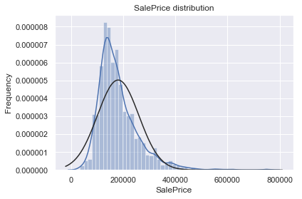


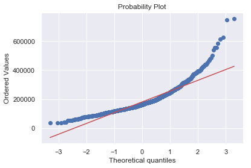


```python
#We use the numpy fuction log1p which  applies log(1+x) to all elements of the column
train["SalePrice"] = np.log1p(train["SalePrice"])

#Check the new distribution 
sns.distplot(train['SalePrice'] , fit=norm);
plt.ylabel('Frequency')
plt.title('SalePrice distribution')

#Get also the QQ-plot
fig = plt.figure()
res = stats.probplot(train['SalePrice'], plot=plt)

```


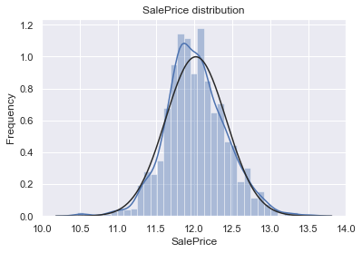


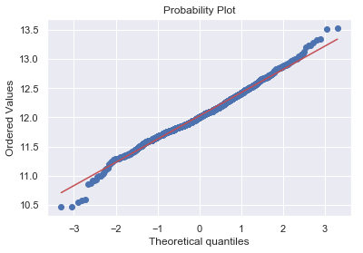


#The skew seems now corrected and the data appears more normally distributed. 


```python
#Correlation map to see how features are correlated with SalePrice
corrmat = train.corr()
plt.subplots(figsize=(12,9))
sns.heatmap(corrmat, vmax=0.9, square=True);
```


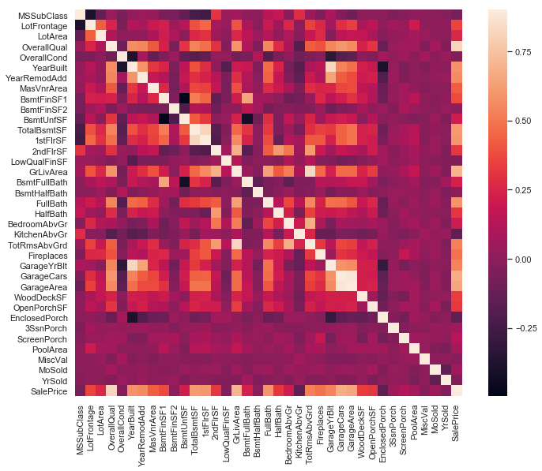


```python
#missing data
total = train.isnull().sum().sort_values(ascending=False)
percent = (train.isnull().sum()/train.isnull().count()).sort_values(ascending=False)
missing_data = pd.concat([total, percent], axis=1, keys=['Total', 'Percent'])
missing_data.head(20)
```


<div>
<style scoped>
    .dataframe tbody tr th:only-of-type {
        vertical-align: middle;
    }

    .dataframe tbody tr th {
        vertical-align: top;
    }

    .dataframe thead th {
        text-align: right;
    }
</style>
<table border="1" class="dataframe">
  <thead>
    <tr style="text-align: right;">
      <th></th>
      <th>Total</th>
      <th>Percent</th>
    </tr>
  </thead>
  <tbody>
    <tr>
      <th>PoolQC</th>
      <td>1453</td>
      <td>0.995</td>
    </tr>
    <tr>
      <th>MiscFeature</th>
      <td>1406</td>
      <td>0.963</td>
    </tr>
    <tr>
      <th>Alley</th>
      <td>1369</td>
      <td>0.938</td>
    </tr>
    <tr>
      <th>Fence</th>
      <td>1179</td>
      <td>0.808</td>
    </tr>
    <tr>
      <th>FireplaceQu</th>
      <td>690</td>
      <td>0.473</td>
    </tr>
    <tr>
      <th>LotFrontage</th>
      <td>259</td>
      <td>0.177</td>
    </tr>
    <tr>
      <th>GarageType</th>
      <td>81</td>
      <td>0.055</td>
    </tr>
    <tr>
      <th>GarageCond</th>
      <td>81</td>
      <td>0.055</td>
    </tr>
    <tr>
      <th>GarageFinish</th>
      <td>81</td>
      <td>0.055</td>
    </tr>
    <tr>
      <th>GarageQual</th>
      <td>81</td>
      <td>0.055</td>
    </tr>
    <tr>
      <th>GarageYrBlt</th>
      <td>81</td>
      <td>0.055</td>
    </tr>
    <tr>
      <th>BsmtFinType2</th>
      <td>38</td>
      <td>0.026</td>
    </tr>
    <tr>
      <th>BsmtExposure</th>
      <td>38</td>
      <td>0.026</td>
    </tr>
    <tr>
      <th>BsmtQual</th>
      <td>37</td>
      <td>0.025</td>
    </tr>
    <tr>
      <th>BsmtCond</th>
      <td>37</td>
      <td>0.025</td>
    </tr>
    <tr>
      <th>BsmtFinType1</th>
      <td>37</td>
      <td>0.025</td>
    </tr>
    <tr>
      <th>MasVnrArea</th>
      <td>8</td>
      <td>0.005</td>
    </tr>
    <tr>
      <th>MasVnrType</th>
      <td>8</td>
      <td>0.005</td>
    </tr>
    <tr>
      <th>Electrical</th>
      <td>1</td>
      <td>0.001</td>
    </tr>
    <tr>
      <th>RoofMatl</th>
      <td>0</td>
      <td>0.000</td>
    </tr>
  </tbody>
</table>
</div>


## Check distributions of continuos data to decide to replace with mean, median , mode etc


```python
sns.distplot(train['LotFrontage'].dropna() , fit=norm);
```


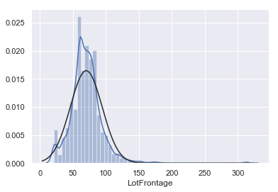


```python
train['MSZoning'].value_counts(normalize=True)
sns.catplot(x="MSZoning", kind="count", palette = "muted", data=train);
```


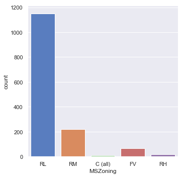


```python
train["PoolQC"] = train["PoolQC"].fillna("None")

#Group by neighborhood and fill in missing value by the median LotFrontage of all the neighborhood
train["LotFrontage"] = train.groupby("Neighborhood")["LotFrontage"].transform(lambda x: x.fillna(x.median()))

for col in ('GarageYrBlt', 'GarageArea', 'GarageCars'):
    train[col] = train[col].fillna(0)
    
for col in ('BsmtQual', 'BsmtCond', 'BsmtExposure', 'BsmtFinType1', 'BsmtFinType2'):
    train[col] = train[col].fillna('None')
    
train['MSZoning'] = train['MSZoning'].fillna(train['MSZoning'].mode()[0])

train = train.drop(['Utilities'], axis=1)

train["Functional"] = train["Functional"].fillna("Typ")
```


```python
#Check remaining missing values if any 
total = train.isnull().sum().sort_values(ascending=False)
percent = (train.isnull().sum()/train.isnull().count()).sort_values(ascending=False)
missing_data = pd.concat([total, percent], axis=1, keys=['Total', 'Percent'])
missing_data.head(20)
```


<div>
<style scoped>
    .dataframe tbody tr th:only-of-type {
        vertical-align: middle;
    }

    .dataframe tbody tr th {
        vertical-align: top;
    }

    .dataframe thead th {
        text-align: right;
    }
</style>
<table border="1" class="dataframe">
  <thead>
    <tr style="text-align: right;">
      <th></th>
      <th>Total</th>
      <th>Percent</th>
    </tr>
  </thead>
  <tbody>
    <tr>
      <th>MiscFeature</th>
      <td>1406</td>
      <td>0.963</td>
    </tr>
    <tr>
      <th>Alley</th>
      <td>1369</td>
      <td>0.938</td>
    </tr>
    <tr>
      <th>Fence</th>
      <td>1179</td>
      <td>0.808</td>
    </tr>
    <tr>
      <th>FireplaceQu</th>
      <td>690</td>
      <td>0.473</td>
    </tr>
    <tr>
      <th>GarageType</th>
      <td>81</td>
      <td>0.055</td>
    </tr>
    <tr>
      <th>GarageFinish</th>
      <td>81</td>
      <td>0.055</td>
    </tr>
    <tr>
      <th>GarageQual</th>
      <td>81</td>
      <td>0.055</td>
    </tr>
    <tr>
      <th>GarageCond</th>
      <td>81</td>
      <td>0.055</td>
    </tr>
    <tr>
      <th>MasVnrType</th>
      <td>8</td>
      <td>0.005</td>
    </tr>
    <tr>
      <th>MasVnrArea</th>
      <td>8</td>
      <td>0.005</td>
    </tr>
    <tr>
      <th>Electrical</th>
      <td>1</td>
      <td>0.001</td>
    </tr>
    <tr>
      <th>SalePrice</th>
      <td>0</td>
      <td>0.000</td>
    </tr>
    <tr>
      <th>RoofMatl</th>
      <td>0</td>
      <td>0.000</td>
    </tr>
    <tr>
      <th>Exterior1st</th>
      <td>0</td>
      <td>0.000</td>
    </tr>
    <tr>
      <th>Exterior2nd</th>
      <td>0</td>
      <td>0.000</td>
    </tr>
    <tr>
      <th>ExterCond</th>
      <td>0</td>
      <td>0.000</td>
    </tr>
    <tr>
      <th>ExterQual</th>
      <td>0</td>
      <td>0.000</td>
    </tr>
    <tr>
      <th>YearRemodAdd</th>
      <td>0</td>
      <td>0.000</td>
    </tr>
    <tr>
      <th>Foundation</th>
      <td>0</td>
      <td>0.000</td>
    </tr>
    <tr>
      <th>BsmtQual</th>
      <td>0</td>
      <td>0.000</td>
    </tr>
  </tbody>
</table>
</div>


```python
len(train.columns)
```


    79


```python
train=train.drop(['MiscFeature','Alley','Fence','FireplaceQu','GarageType','GarageFinish','GarageQual','GarageCond','MasVnrType','MasVnrArea','Electrical'],
          axis=1
          )
```


```python
g = sns.catplot(x="MSZoning",y="SalePrice" , data=train, kind="bar", size = 5 , palette = "muted")
g.despine(left=True)
g = g.set_ylabels("avg price")


```


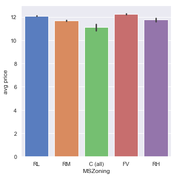


# Check Outliers 


```python
numeric_feats = train.dtypes[train.dtypes != "object"].index
len(numeric_feats)

```


    36


```python
g = sns.pairplot(train,x_vars=numeric_feats[:3], y_vars=["SalePrice"], size=5.5)
```


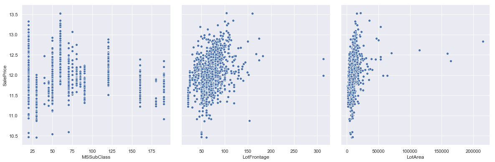


```python
g = sns.pairplot(train,x_vars=numeric_feats[3:6], y_vars=["SalePrice"], size=5.5)
```


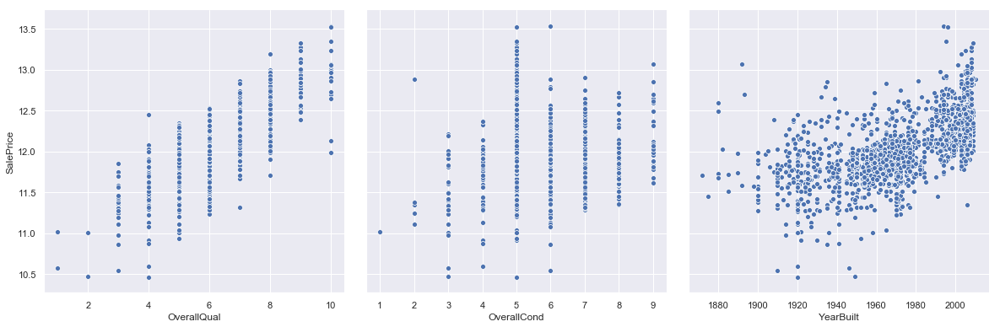


```python
g = sns.pairplot(train,x_vars=numeric_feats[7:10], y_vars=["SalePrice"], size=5.5)
```


```python
g = sns.pairplot(train,x_vars=numeric_feats[7:10], y_vars=["SalePrice"], size=5.5)
```


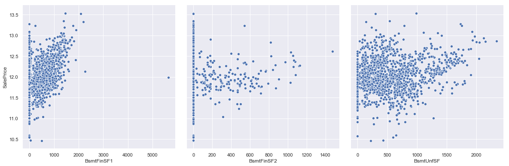


```python
fig, ax = plt.subplots()
ax.scatter(x = train['GrLivArea'], y = train['SalePrice'])
plt.ylabel('SalePrice', fontsize=13)
plt.xlabel('GrLivArea', fontsize=13)
plt.show()
```


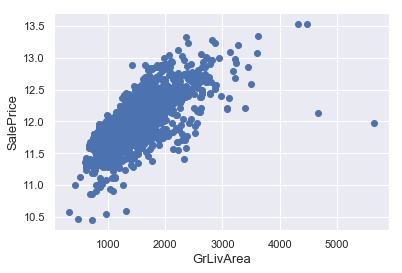


```python
#Deleting outliers
train = train.drop(train[(train['GrLivArea']>4000) & (train['SalePrice']<300000)].index)

#Check the graphic again
fig, ax = plt.subplots()
ax.scatter(train['GrLivArea'], train['SalePrice'])
plt.ylabel('SalePrice', fontsize=13)
plt.xlabel('GrLivArea', fontsize=13)
plt.show()
```


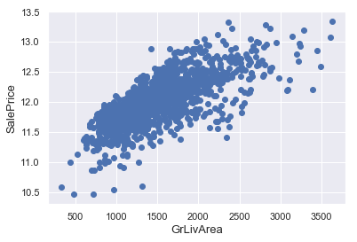


```python
#scatterplot
sns.set()
cols = ['SalePrice', 'OverallQual', 'GrLivArea', 'GarageCars', 'TotalBsmtSF', 'FullBath', 'YearBuilt']
sns.pairplot(df_train[cols], size = 2.5)
plt.show();
```


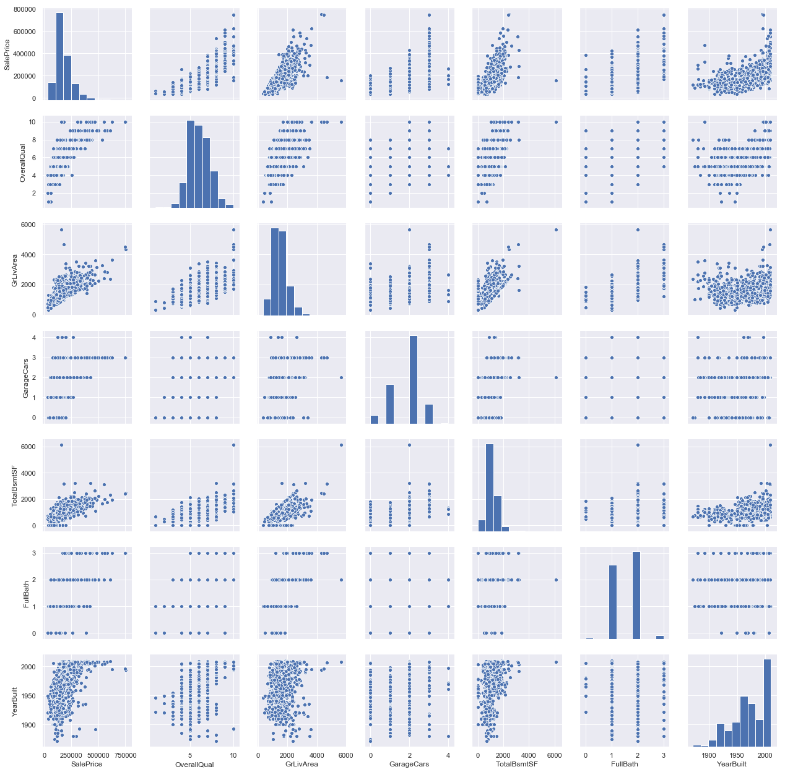


## Transforming some numerical variables that are really categorical


```python
#MSSubClass=The building class
train['MSSubClass'] = train['MSSubClass'].apply(str)


#Changing OverallCond into a categorical variable
train['OverallCond'] = train['OverallCond'].astype(str)


#Year and month sold are transformed into categorical features.
train['YrSold'] = train['YrSold'].astype(str)
train['MoSold'] = train['MoSold'].astype(str)
```

### Label Encoding some categorical variables that may contain information in their ordering set


```python


from sklearn.preprocessing import LabelEncoder
cols = ( 'BsmtQual', 'BsmtCond', 
        'ExterQual', 'ExterCond','HeatingQC', 'PoolQC', 'KitchenQual', 'BsmtFinType1', 
        'BsmtFinType2', 'Functional', 'BsmtExposure',  'LandSlope',
        'LotShape', 'PavedDrive', 'Street',  'CentralAir', 'MSSubClass', 'OverallCond', 
        'YrSold', 'MoSold')
# process columns, apply LabelEncoder to categorical features

for c in cols:
    lbl = LabelEncoder() 
    lbl.fit(list(train[c].values)) 
    train[c] = lbl.transform(list(train[c].values))

# shape        
print('Shape all_data: {}'.format(train.shape))


```

    Shape all_data: (1456, 68)


### Adding one more important feature


```python
# Adding total sqfootage feature 
train['TotalSF'] = train['TotalBsmtSF'] + train['1stFlrSF'] + train['2ndFlrSF']
```


```python
# Skewed features

numeric_feats = train.dtypes[train.dtypes != "object"].index

# Check the skew of all numerical features
skewed_feats = train[numeric_feats].apply(lambda x: skew(x.dropna())).sort_values(ascending=False)
print("\nSkew in numerical features: \n")
skewness = pd.DataFrame({'Skew' :skewed_feats})
skewness.head(20)

```

    
    Skew in numerical features: 
    


<div>
<style scoped>
    .dataframe tbody tr th:only-of-type {
        vertical-align: middle;
    }

    .dataframe tbody tr th {
        vertical-align: top;
    }

    .dataframe thead th {
        text-align: right;
    }
</style>
<table border="1" class="dataframe">
  <thead>
    <tr style="text-align: right;">
      <th></th>
      <th>Skew</th>
    </tr>
  </thead>
  <tbody>
    <tr>
      <th>MiscVal</th>
      <td>24.418</td>
    </tr>
    <tr>
      <th>PoolArea</th>
      <td>17.505</td>
    </tr>
    <tr>
      <th>LotArea</th>
      <td>12.575</td>
    </tr>
    <tr>
      <th>3SsnPorch</th>
      <td>10.279</td>
    </tr>
    <tr>
      <th>LowQualFinSF</th>
      <td>8.989</td>
    </tr>
    <tr>
      <th>LandSlope</th>
      <td>4.801</td>
    </tr>
    <tr>
      <th>KitchenAbvGr</th>
      <td>4.477</td>
    </tr>
    <tr>
      <th>BsmtFinSF2</th>
      <td>4.244</td>
    </tr>
    <tr>
      <th>BsmtHalfBath</th>
      <td>4.125</td>
    </tr>
    <tr>
      <th>ScreenPorch</th>
      <td>4.111</td>
    </tr>
    <tr>
      <th>EnclosedPorch</th>
      <td>3.081</td>
    </tr>
    <tr>
      <th>OpenPorchSF</th>
      <td>2.337</td>
    </tr>
    <tr>
      <th>WoodDeckSF</th>
      <td>1.550</td>
    </tr>
    <tr>
      <th>LotFrontage</th>
      <td>1.535</td>
    </tr>
    <tr>
      <th>BsmtUnfSF</th>
      <td>0.921</td>
    </tr>
    <tr>
      <th>1stFlrSF</th>
      <td>0.866</td>
    </tr>
    <tr>
      <th>GrLivArea</th>
      <td>0.834</td>
    </tr>
    <tr>
      <th>2ndFlrSF</th>
      <td>0.777</td>
    </tr>
    <tr>
      <th>BsmtFinSF1</th>
      <td>0.744</td>
    </tr>
    <tr>
      <th>OverallCond</th>
      <td>0.690</td>
    </tr>
  </tbody>
</table>
</div>


Box Cox Transformation of (highly) skewed features

We use the scipy function boxcox1p which computes the Box-Cox transformation of 1+𝑥.

Note that setting 𝜆=0

is equivalent to log1p used above for the target variable.

See [this page][1] for more details on Box Cox Transformation as well as [the scipy function's page][2] [1]: http://onlinestatbook.com/2/transformations/box-cox.html [2]: https://docs.scipy.org/doc/scipy-0.19.0/reference/generated/scipy.special.boxcox1p.html


```python
skew = abs(skewness) > 0.75
skewness = skewness[skew.Skew]

print("There are {} skewed numerical features to Box Cox transform".format(skewness.shape[0]))

from scipy.special import boxcox1p
skewed_features = skewness.index
lam = 0.15
for feat in skewed_features:
    #all_data[feat] += 1
    train[feat] = boxcox1p(train[feat], lam)
    
#all_data[skewed_features] = np.log1p(all_data[skewed_features])
```

    There are 30 skewed numerical features to Box Cox transform


## Getting dummy categorical features


```python
train = pd.get_dummies(train)
print(train.shape)

```

    (1456, 193)


```python
train.head()
```


<div>
<style scoped>
    .dataframe tbody tr th:only-of-type {
        vertical-align: middle;
    }

    .dataframe tbody tr th {
        vertical-align: top;
    }

    .dataframe thead th {
        text-align: right;
    }
</style>
<table border="1" class="dataframe">
  <thead>
    <tr style="text-align: right;">
      <th></th>
      <th>MSSubClass</th>
      <th>LotFrontage</th>
      <th>LotArea</th>
      <th>Street</th>
      <th>LotShape</th>
      <th>LandSlope</th>
      <th>OverallQual</th>
      <th>OverallCond</th>
      <th>YearBuilt</th>
      <th>YearRemodAdd</th>
      <th>...</th>
      <th>SaleType_ConLw</th>
      <th>SaleType_New</th>
      <th>SaleType_Oth</th>
      <th>SaleType_WD</th>
      <th>SaleCondition_Abnorml</th>
      <th>SaleCondition_AdjLand</th>
      <th>SaleCondition_Alloca</th>
      <th>SaleCondition_Family</th>
      <th>SaleCondition_Normal</th>
      <th>SaleCondition_Partial</th>
    </tr>
  </thead>
  <tbody>
    <tr>
      <th>0</th>
      <td>9</td>
      <td>5.831</td>
      <td>19.212</td>
      <td>0.730</td>
      <td>3</td>
      <td>0.000</td>
      <td>7</td>
      <td>4</td>
      <td>2003</td>
      <td>2003</td>
      <td>...</td>
      <td>0</td>
      <td>0</td>
      <td>0</td>
      <td>1</td>
      <td>0</td>
      <td>0</td>
      <td>0</td>
      <td>0</td>
      <td>1</td>
      <td>0</td>
    </tr>
    <tr>
      <th>1</th>
      <td>4</td>
      <td>6.221</td>
      <td>19.712</td>
      <td>0.730</td>
      <td>3</td>
      <td>0.000</td>
      <td>6</td>
      <td>7</td>
      <td>1976</td>
      <td>1976</td>
      <td>...</td>
      <td>0</td>
      <td>0</td>
      <td>0</td>
      <td>1</td>
      <td>0</td>
      <td>0</td>
      <td>0</td>
      <td>0</td>
      <td>1</td>
      <td>0</td>
    </tr>
    <tr>
      <th>2</th>
      <td>9</td>
      <td>5.915</td>
      <td>20.347</td>
      <td>0.730</td>
      <td>0</td>
      <td>0.000</td>
      <td>7</td>
      <td>4</td>
      <td>2001</td>
      <td>2002</td>
      <td>...</td>
      <td>0</td>
      <td>0</td>
      <td>0</td>
      <td>1</td>
      <td>0</td>
      <td>0</td>
      <td>0</td>
      <td>0</td>
      <td>1</td>
      <td>0</td>
    </tr>
    <tr>
      <th>3</th>
      <td>10</td>
      <td>5.685</td>
      <td>19.692</td>
      <td>0.730</td>
      <td>0</td>
      <td>0.000</td>
      <td>7</td>
      <td>4</td>
      <td>1915</td>
      <td>1970</td>
      <td>...</td>
      <td>0</td>
      <td>0</td>
      <td>0</td>
      <td>1</td>
      <td>1</td>
      <td>0</td>
      <td>0</td>
      <td>0</td>
      <td>0</td>
      <td>0</td>
    </tr>
    <tr>
      <th>4</th>
      <td>9</td>
      <td>6.315</td>
      <td>21.325</td>
      <td>0.730</td>
      <td>0</td>
      <td>0.000</td>
      <td>8</td>
      <td>4</td>
      <td>2000</td>
      <td>2000</td>
      <td>...</td>
      <td>0</td>
      <td>0</td>
      <td>0</td>
      <td>1</td>
      <td>0</td>
      <td>0</td>
      <td>0</td>
      <td>0</td>
      <td>1</td>
      <td>0</td>
    </tr>
  </tbody>
</table>
<p>5 rows × 193 columns</p>
</div>


```python
ntrain = train.shape[0]
ntest = test.shape[0]
y_train = train.SalePrice.values
```


```python
train = train.drop('SalePrice', axis=1)
```

# Modelling


```python
from sklearn.linear_model import ElasticNet, Lasso,ElasticNetCV,  BayesianRidge, LassoLarsIC
from sklearn.ensemble import RandomForestRegressor,  GradientBoostingRegressor
from sklearn.kernel_ridge import KernelRidge
from sklearn.pipeline import make_pipeline
from sklearn.preprocessing import RobustScaler
from sklearn.base import BaseEstimator, TransformerMixin, RegressorMixin, clone
from sklearn.model_selection import KFold, cross_val_score, train_test_split
from sklearn.metrics import mean_squared_error
import xgboost as xgb
```


```python
#Validation function
#Note how the optimal value of alpha varies for each fold. This illustrates why nested-cross validation is necessary when trying to evaluate the performance of a method for which a parameter is chosen by cross-validation: this choice of parameter may not be optimal for unseen data.

n_folds = 15
def rmse_cv(model, X, y):
    kf = KFold(n_splits=n_folds, shuffle=True, random_state=42)
    rmse= np.sqrt(-cross_val_score(model, X, y, scoring="neg_mean_squared_error", cv = kf))
    return(rmse)
```


```python
from sklearn import preprocessing
scaler = preprocessing.RobustScaler().fit(train.values)
X_train_transformed = scaler.transform(train.values)
```


```python
#First try giving default alphas for cv and then look at the range of alphas tried and then give a list of alphas

enetcv = ElasticNetCV(alphas=[0.005, 0.05, 0.1, 0.3, 1, 3, 5, 10,20,30],
                    l1_ratio=[.1, .5, .7, .9, .95, .99, 1], 
                    cv=10, n_alphas=100,)
enetcv.fit(X_train_transformed, y_train)

enetcv.mse_path_
print(enetcv.alpha_)
print(enetcv.l1_ratio_)
#enetcv.coef_
#enetcv.alphas_ 

#Then choose the best alpha and then give it to the pipeline
```

    0.005
    0.1


```python
rmse_cv(ElasticNet(alpha=0.005, l1_ratio=.1, random_state=3),X_train_transformed, y_train).mean()
```


    0.10982260686832228


```python
coef = pd.Series(enetcv.coef_, index = train.columns)
```


```python
print("Lasso picked " + str(sum(coef != 0)) + " variables and eliminated the other " +  str(sum(coef == 0)) + " variables")


```

    ElasticNet picked 93 variables and eliminated the other 99 variables


```python
imp_coef = pd.concat([coef.sort_values().head(10),
                     coef.sort_values().tail(10)])
```


```python
plt.rcParams['figure.figsize'] = (8.0, 10.0)
imp_coef.plot(kind = "barh")
plt.title("Coefficients in the Lasso Model")
```


    Text(0.5, 1.0, 'Coefficients in the Lasso Model')


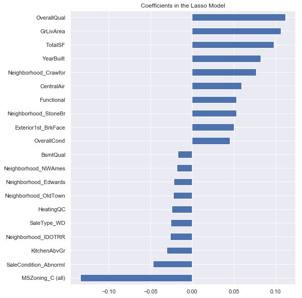


```python
sns.distplot(preds["residuals"]);
```


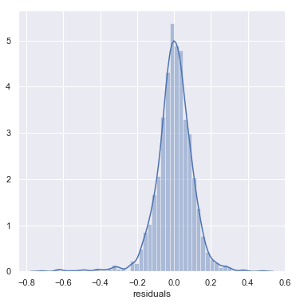


```python
fig = plt.figure()
res = stats.probplot(preds["residuals"], plot=plt)
```


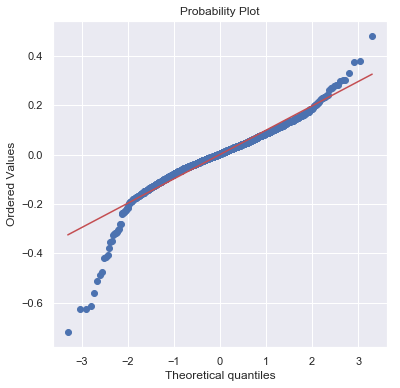


```python
#let's look at the residuals as well:

plt.rcParams['figure.figsize'] = (6.0, 6.0)
preds = pd.DataFrame({"preds":enetcv.predict(X_train_transformed), "true":y_train})
preds["residuals"] = preds["true"] - preds["preds"]
preds.plot(x = "preds", y = "residuals",kind = "scatter");

```

    'c' argument looks like a single numeric RGB or RGBA sequence, which should be avoided as value-mapping will have precedence in case its length matches with 'x' & 'y'.  Please use a 2-D array with a single row if you really want to specify the same RGB or RGBA value for all points.


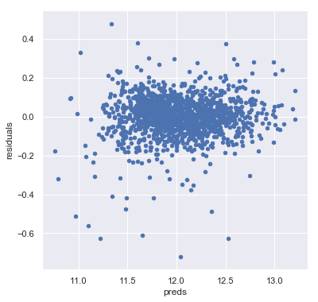


```python
dtrain = xgb.DMatrix(X_train_transformed, label = y_train)
#dtest = xgb.DMatrix(X_test)

params = {"max_depth":4, "learning_rate":0.05}

model = xgb.cv(params, nfold=10, dtrain,  num_boost_round=500, shuffle=True)

```


```python
model.shape[0]
```


    500


```python
model.loc[60:,["test-rmse-mean", "train-rmse-mean"]].plot()
```


    <matplotlib.axes._subplots.AxesSubplot at 0x1a2b4992b0>


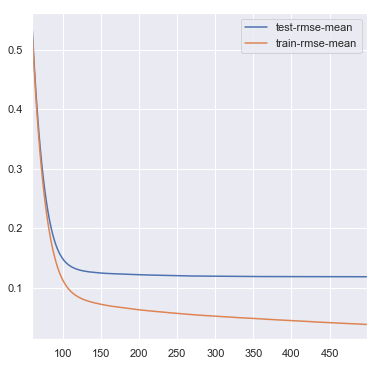


```python
model_xgb = xgb.XGBRegressor(objective="reg:squarederror", booster=gbtree,
    colsample_bytree=0.6, gamma=0.01, 
                             learning_rate=0.05, max_depth=4, 
                             n_estimators=1000,
                             reg_alpha=0.4, 
                             reg_lambda=0.8,
                             subsample=0.5, 
                             random_state =7, 
                            )
```


```python

score = rmse_cv(model_xgb,X_train_transformed,y_train)
print("Xgboost score: {:.4f} ({:.4f})\n".format(score.mean(), score.std()))
```

    Xgboost score: 0.1161 (0.0147)
    


```python
featureimportances= pd.Series(model_xgb.fit(X_train_transformed,y_train).feature_importances_, index=train.columns)

featureimportances
```


    MSSubClass              0.002
    LotFrontage             0.002
    LotArea                 0.005
    Street                  0.004
    LotShape                0.002
    LandSlope               0.002
    OverallQual             0.053
    OverallCond             0.010
    YearBuilt               0.017
    YearRemodAdd            0.014
    ExterQual               0.004
    ExterCond               0.002
    BsmtQual                0.007
    BsmtCond                0.003
    BsmtExposure            0.003
    BsmtFinType1            0.003
    BsmtFinSF1              0.006
    BsmtFinType2            0.002
    BsmtFinSF2              0.002
    BsmtUnfSF               0.003
    TotalBsmtSF             0.002
    HeatingQC               0.003
    CentralAir              0.018
    1stFlrSF                0.004
    2ndFlrSF                0.002
    LowQualFinSF            0.001
    GrLivArea               0.008
    BsmtFullBath            0.002
    BsmtHalfBath            0.003
    FullBath                0.003
                             ... 
    Exterior2nd_VinylSd     0.003
    Exterior2nd_Wd Sdng     0.002
    Exterior2nd_Wd Shng     0.003
    Foundation_BrkTil       0.004
    Foundation_CBlock       0.003
    Foundation_PConc        0.002
    Foundation_Slab         0.002
    Foundation_Stone        0.002
    Foundation_Wood         0.006
    Heating_Floor           0.000
    Heating_GasA            0.022
    Heating_GasW            0.000
    Heating_Grav            0.021
    Heating_OthW            0.000
    Heating_Wall            0.000
    SaleType_COD            0.005
    SaleType_CWD            0.000
    SaleType_Con            0.000
    SaleType_ConLD          0.014
    SaleType_ConLI          0.000
    SaleType_ConLw          0.000
    SaleType_New            0.016
    SaleType_Oth            0.007
    SaleType_WD             0.002
    SaleCondition_Abnorml   0.007
    SaleCondition_AdjLand   0.000
    SaleCondition_Alloca    0.005
    SaleCondition_Family    0.014
    SaleCondition_Normal    0.002
    SaleCondition_Partial   0.003
    Length: 192, dtype: float32


```python
print("xgb picked " + str(sum(featureimportances != 0)) + " variables and eliminated the other " +  str(sum(featureimportances == 0)) + " variables")

imp_coef = pd.concat([featureimportances.sort_values().head(1),
                     featureimportances.sort_values().tail(10)])

plt.rcParams['figure.figsize'] = (8.0, 10.0)
imp_coef.plot(kind = "barh")
plt.title("Coefficients in the Lasso Model")
```

    xgb picked 148 variables and eliminated the other 44 variables


    Text(0.5, 1.0, 'Coefficients in the Lasso Model')


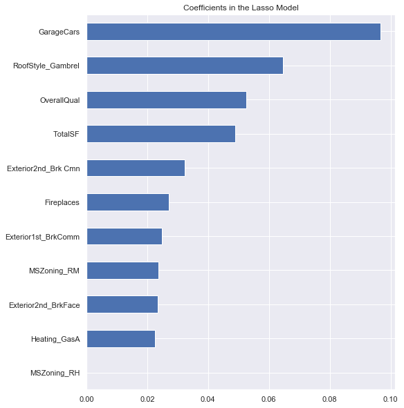


```python
xgb_preds = np.expm1(model_xgb.predict(X_test))
lasso_preds = np.expm1(model_lasso.predict(X_test))
```


```python
predictions = pd.DataFrame({"xgb":xgb_preds, "lasso":lasso_preds})
predictions.plot(x = "xgb", y = "lasso", kind = "scatter")
```


```python

```


```python
from sklearn.model_selection import GridSearchCV 
param_test1 = {
 'max_depth':range(3,6,1),
 'min_child_weight':range(1,5,1)
}
gsearch1 = GridSearchCV(estimator = xgb.XGBRegressor( learning_rate =0.1, n_estimators=140, max_depth=5,
 min_child_weight=1, gamma=0, subsample=0.8, colsample_bytree=0.8,
 objective= 'reg:squarederror', nthread=4, scale_pos_weight=1, seed=27), 
 param_grid = param_test1, scoring="neg_mean_squared_error",n_jobs=4,iid=False, cv=10)

gsearch1.fit(X_train_transformed,y_train)


```


    GridSearchCV(cv=10, error_score=nan,
                 estimator=XGBRegressor(base_score=0.5, booster='gbtree',
                                        colsample_bylevel=1, colsample_bynode=1,
                                        colsample_bytree=0.8, gamma=0,
                                        importance_type='gain', learning_rate=0.1,
                                        max_delta_step=0, max_depth=5,
                                        min_child_weight=1, missing=None,
                                        n_estimators=140, n_jobs=1, nthread=4,
                                        objective='reg:squarederror',
                                        random_state=0, reg_alpha=0, reg_lambda=1,
                                        scale_pos_weight=1, seed=27, silent=None,
                                        subsample=0.8, verbosity=1),
                 iid=False, n_jobs=4,
                 param_grid={'max_depth': range(3, 6),
                             'min_child_weight': range(1, 5)},
                 pre_dispatch='2*n_jobs', refit=True, return_train_score=False,
                 scoring='neg_mean_squared_error', verbose=0)


```python
gsearch1.best_params_, gsearch1.best_score_
```


    ({'max_depth': 4, 'min_child_weight': 3}, -0.01314168075964527)


```python
gsearch1.cv_results_
```


    {'mean_fit_time': array([0.97056448, 0.98804343, 0.97078013, 0.95879691, 1.11513677,
            1.11547906, 1.11122682, 1.14025736, 1.29335279, 1.29725356,
            1.26042447, 1.26248469]),
     'std_fit_time': array([0.01642667, 0.01158955, 0.01594978, 0.00430799, 0.00448222,
            0.01473462, 0.00593129, 0.02960172, 0.03218907, 0.02794951,
            0.01209994, 0.00803716]),
     'mean_score_time': array([0.0013056 , 0.00136976, 0.0013901 , 0.00129783, 0.00150898,
            0.00137937, 0.00142858, 0.00138032, 0.00160589, 0.00153461,
            0.00161717, 0.00154266]),
     'std_score_time': array([6.04938414e-05, 1.09609855e-04, 1.03249684e-04, 4.85836286e-05,
            1.54910532e-04, 6.43612047e-05, 7.62901790e-05, 5.60642949e-05,
            9.58903520e-05, 3.83294035e-05, 1.27209414e-04, 6.82227338e-05]),
     'param_max_depth': masked_array(data=[3, 3, 3, 3, 4, 4, 4, 4, 5, 5, 5, 5],
                  mask=[False, False, False, False, False, False, False, False,
                        False, False, False, False],
            fill_value='?',
                 dtype=object),
     'param_min_child_weight': masked_array(data=[1, 2, 3, 4, 1, 2, 3, 4, 1, 2, 3, 4],
                  mask=[False, False, False, False, False, False, False, False,
                        False, False, False, False],
            fill_value='?',
                 dtype=object),
     'params': [{'max_depth': 3, 'min_child_weight': 1},
      {'max_depth': 3, 'min_child_weight': 2},
      {'max_depth': 3, 'min_child_weight': 3},
      {'max_depth': 3, 'min_child_weight': 4},
      {'max_depth': 4, 'min_child_weight': 1},
      {'max_depth': 4, 'min_child_weight': 2},
      {'max_depth': 4, 'min_child_weight': 3},
      {'max_depth': 4, 'min_child_weight': 4},
      {'max_depth': 5, 'min_child_weight': 1},
      {'max_depth': 5, 'min_child_weight': 2},
      {'max_depth': 5, 'min_child_weight': 3},
      {'max_depth': 5, 'min_child_weight': 4}],
     'split0_test_score': array([-0.01413764, -0.01375003, -0.01286884, -0.01341084, -0.01433333,
            -0.01369653, -0.01209583, -0.013459  , -0.01444283, -0.01396687,
            -0.01262639, -0.01352149]),
     'split1_test_score': array([-0.01066758, -0.0104693 , -0.00975535, -0.01015688, -0.01045763,
            -0.01005528, -0.00951873, -0.01008662, -0.01097602, -0.01044121,
            -0.01059566, -0.00914543]),
     'split2_test_score': array([-0.01223779, -0.01203754, -0.01187267, -0.01212739, -0.01239897,
            -0.01314147, -0.0119938 , -0.012321  , -0.01161112, -0.01350966,
            -0.01226246, -0.01219507]),
     'split3_test_score': array([-0.01679441, -0.01674207, -0.0172945 , -0.01664949, -0.01521089,
            -0.01576818, -0.01675299, -0.01720063, -0.01523827, -0.01594696,
            -0.01660652, -0.01616028]),
     'split4_test_score': array([-0.02009994, -0.02012052, -0.02035644, -0.02063011, -0.02017092,
            -0.01978154, -0.02014467, -0.01946667, -0.02128351, -0.02007409,
            -0.02085262, -0.02121061]),
     'split5_test_score': array([-0.0099128 , -0.01068486, -0.01066542, -0.01069079, -0.01012271,
            -0.01116715, -0.00993337, -0.01079766, -0.01031672, -0.01167508,
            -0.01095794, -0.01079701]),
     'split6_test_score': array([-0.01553813, -0.014304  , -0.01457671, -0.01336849, -0.01504445,
            -0.01387889, -0.01425213, -0.01418898, -0.0147977 , -0.01348183,
            -0.01291856, -0.0133428 ]),
     'split7_test_score': array([-0.01004163, -0.01000443, -0.00998092, -0.01057247, -0.01046779,
            -0.01057664, -0.0096904 , -0.01069691, -0.01119556, -0.01018669,
            -0.01027434, -0.01060111]),
     'split8_test_score': array([-0.00922135, -0.00961866, -0.00905915, -0.00929184, -0.0099404 ,
            -0.00905317, -0.00895601, -0.00906434, -0.00991439, -0.0097177 ,
            -0.00877905, -0.00854022]),
     'split9_test_score': array([-0.01903346, -0.01880126, -0.01855016, -0.01895689, -0.01926117,
            -0.01806396, -0.01807889, -0.01865366, -0.01900246, -0.01813958,
            -0.0193451 , -0.0191333 ]),
     'mean_test_score': array([-0.01376847, -0.01365327, -0.01349802, -0.01358552, -0.01374083,
            -0.01351828, -0.01314168, -0.01359355, -0.01387786, -0.01371397,
            -0.01352186, -0.01346473]),
     'std_test_score': array([0.00376327, 0.00359795, 0.00381158, 0.00371105, 0.00356172,
            0.00333719, 0.00378093, 0.00352308, 0.00365055, 0.00329337,
            0.0038483 , 0.00399064]),
     'rank_test_score': array([11,  8,  3,  6, 10,  4,  1,  7, 12,  9,  5,  2], dtype=int32)}


```python

```


```python

```


```python

```


```python

```


```python

```


```python

```


```python

```


```python
from sklearn.linear_model import Ridge, RidgeCV, ElasticNet, LassoCV, LassoLarsCV

alphas = [0.0005,  0.005, 0.05,0.1, 0.3, 1, 2, 3, 3.5,4.5, 5,6,7,8,9, 10,20,30]
cv_ridge = [rmse_cv(Ridge(alpha = alpha),X_train_transformed,y_train).mean() for alpha in alphas]

```


```python
cv_ridge = pd.Series(cv_ridge, index = alphas)
cv_ridge.plot(title = "Validation - Just Do It")
plt.xlabel("alpha")
plt.ylabel("rmse")
```


    Text(0, 0.5, 'rmse')


```python
cv_ridge.min()
```


    0.10942850640470038


```python
lasso = make_pipeline(RobustScaler(), Lasso(alpha =0.0005, random_state=1))

```


```python
score = rmse_cv(lasso)
print("\nLasso score: {:.4f} ({:.4f})\n".format(score.mean(), score.std()))
```

    
    Lasso score: 0.1096 (0.0141)
    


```python
score = rmse_cv(ElasticNet(random_state=3))
print("\nLasso score: {:.4f} ({:.4f})\n".format(score.mean(), score.std()))
```

    
    Lasso score: 0.1643 (0.0171)
    


```python

score = rmse_cv(Lasso(alpha =0.0005, random_state=1))
print("\nLasso score: {:.4f} ({:.4f})\n".format(score.mean(), score.std()))

```

    
    Lasso score: 0.1710 (0.0167)
    


```python
score = rmse_cv(ENet)
print("ElasticNet score: {:.4f} ({:.4f})\n".format(score.mean(), score.std()))
```

    ElasticNet score: 0.1231 (0.0183)
    


```python

```
